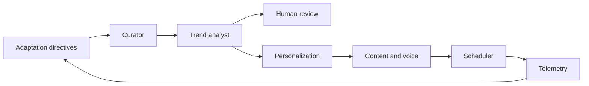

# MoneyBot for OpenClaw

Self-contained **multi-agent workflow** for MoneyBot financial education: seven conversational skills, JSON Schema contracts, and orchestration notes in `AGENTS.md`.

## Upstream projects (GitHub)

Use these as the canonical sources for runtime and methodology:

| Project | GitHub | Notes |
|--------|--------|--------|
| **OpenClaw** | [github.com/openclaw/openclaw](https://github.com/openclaw/openclaw) | Personal AI assistant / gateway; skills live under `~/.openclaw/`. Docs: [docs.openclaw.ai](https://docs.openclaw.ai). |
| **gstack** (Garry Tan) | [github.com/garrytan/gstack](https://github.com/garrytan/gstack) | Layered “virtual engineering team” skills (plan → review → ship). Aligns with this pack’s **contracts + feedback loops**; install gstack separately if you want `/office-hours`, `/plan-ceo-review`, `/ship`, etc., alongside MoneyBot. |
| **gbrain** (optional) | [github.com/garrytan/gbrain](https://github.com/garrytan/gbrain) | Garry’s OpenClaw-oriented agent brain patterns; use if you want a shared memory/knowledge style for long-running MoneyBot runs. |

Install OpenClaw per upstream README (e.g. `npm install -g openclaw@latest`, then `openclaw onboard` as documented in the repo).

## Layout

| Path | Purpose |
|------|---------|
| `AGENTS.md` | Orchestrator: pipeline order, dispatch table, human review gates |
| `schemas/*.schema.json` | Handoff contracts between agents |
| `.openclaw/skills/moneybot-*/SKILL.md` | One skill per agent (Curator → … → Adaptation) |

## Install into OpenClaw

**Windows (from this repo):** run `powershell -ExecutionPolicy Bypass -File scripts/install-to-openclaw.ps1` from the `moneybot-openclaw` folder. That copies skills to `%USERPROFILE%\.openclaw\skills\` and mirrors the pack to `%USERPROFILE%\.openclaw\moneybot-openclaw`.

**macOS / Linux:** from the `moneybot-openclaw` folder run `chmod +x scripts/*.sh` once, then `./scripts/install-to-openclaw.sh` (same layout under `~/.openclaw/`). Register the four agents with `./scripts/setup-four-moneybot-agents.sh` after OpenClaw is installed and `openclaw onboard` (or equivalent) has been completed per [OpenClaw docs](https://docs.openclaw.ai).

1. Copy this entire `moneybot-openclaw` directory to a location your OpenClaw runtime can read, or keep it inside your product monorepo.

2. **Skills** — For each folder under `.openclaw/skills/`, install per your OpenClaw version (e.g. symlink into `~/.openclaw/skills/` on Unix, or copy on Windows):

   - `moneybot-curator`
   - `moneybot-trend-analyst`
   - `moneybot-personalization`
   - `moneybot-content-voice`
   - `moneybot-scheduler-publisher`
   - `moneybot-telemetry`
   - `moneybot-adaptation`

3. **Orchestration** — Use `AGENTS.md` **inside each `workspace-moneybot-*`** (recommended). Avoid merging MoneyBot rules into **Clawski’s** default workspace unless you explicitly want that—see **Do not disturb Clawski or Clawdia 3000** below.

4. **Validation** — Use any JSON Schema validator in CI to check agent outputs against `schemas/`.

## Pipeline (reference)



## Four isolated agents — **Naval’s types of leverage**

The four brands map to **[Naval Ravikant](https://www.navalmanack.com/)**’s leverage frame (labor, capital, code, media): each MoneyBot agent **teaches that leverage type** to young people—plus shared safety rules (educational only, not personalized investment advice).

Templates live under `agents/<agent-id>/` (`AGENTS.md` + `IDENTITY.md`). Register them with OpenClaw:

```powershell
powershell -ExecutionPolicy Bypass -File scripts/setup-four-moneybot-agents.ps1
```

macOS / Linux:

```bash
chmod +x scripts/setup-four-moneybot-agents.sh
./scripts/setup-four-moneybot-agents.sh
```

That creates workspaces under `%USERPROFILE%\.openclaw\workspace-moneybot-*`, copies `schemas/`, and runs `openclaw agents add` + `set-identity` for each.

| Agent id | Brand name | Naval leverage | Role |
|----------|------------|----------------|------|
| `moneybot-labor` | MoneyBot Labor | **Labor** | People, coordination, leadership, collaboration; workplace money basics |
| `moneybot-capital` | MoneyBot Capital | **Capital** | Money & assets working for you; compound growth literacy; judgment |
| `moneybot-code` | MoneyBotCode | **Code** | Software & automation; scales at near–zero marginal cost |
| `moneybot-media` | MoneyBot Media | **Media** | Content, audience, brand; scalable distribution |

### Do not disturb Clawski or Clawdia 3000

MoneyBot is **additive**: scripts and agents only create or refresh ids under `moneybot-*` and paths `workspace-moneybot-*`. They **do not** modify, delete, or rebind **`main` (Clawski)** or **`whatsapp-main` (Clawdia 3000)**.

- **Never** run `openclaw agents bind` on your **existing** default WhatsApp (or other channels Clawdia uses) unless you **intentionally** want to move that traffic off Clawdia—that would **not** be “MoneyBot setup,” it would be **routing migration**.
- To give MoneyBot its **own** entry point, use a **new** channel account, bot, or number—or bind only after adding a **separate** integration. Check routing first: `openclaw agents list --bindings`.
- **Do not** merge this repo’s `AGENTS.md` into Clawski’s default workspace unless you want Clawski’s behavior to change; keep MoneyBot instructions inside **`workspace-moneybot-*`** only.

Docs: [Multi-Agent Routing](https://docs.openclaw.ai/concepts/multi-agent).

**Safe example** (new agent + **dedicated** channel binding—adjust ids to your setup):

```bash
openclaw agents bindings
# bind moneybot-* only to channels that are NOT already bound to main / whatsapp-main
```

## Quick start prompt

Paste into OpenClaw:

> Load MoneyBot skills from my `moneybot-openclaw` project. Run the full pipeline: curate 3 story cards on [topic], trend briefs, personalization for cohort [id], draft gamified content, propose a schedule for app + one social channel. Use schemas for JSON between steps. Stop for human review if any flag requires it.

## License

This pack follows the repository license where it is vendored (see root `LICENSE.md` in the parent project).
